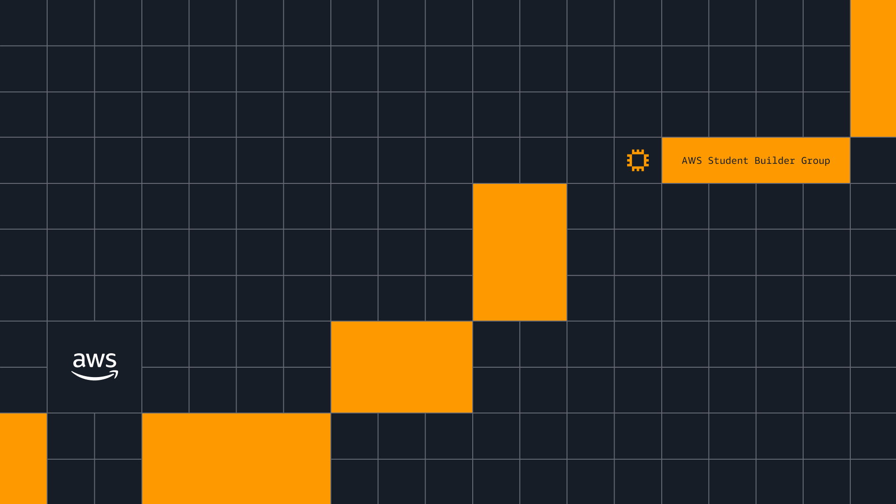

# AWS Student Builder Group - Workshop Template

> Credit: Van Hoang Kha | First Cloud AI Journey



---

Template Hugo dung de tao workshop cho AWS Student Builder Group. Repo nay chua san cau truc, theme, va branding de cac thanh vien co the fork va viet workshop cua rieng minh.

## Huong dan su dung

1. Fork repo nay ve account/org cua ban
2. Thay doi noi dung trong thu muc `content/` theo workshop cua ban
3. Cap nhat `config.toml` (title, description, links)
4. Push len GitHub - site se tu dong deploy qua GitHub Pages

## Chay local

```bash
# Clone repo
git clone <repo-url>
cd <repo-folder>

# Cai Hugo (neu chua co)
# macOS
brew install hugo
# Windows
choco install hugo
# Ubuntu
sudo apt-get install hugo

# Chay local server
hugo server -D
```

Truy cap http://localhost:1313 de xem ket qua.

## Cau truc thu muc

```
content/           # Noi dung workshop (markdown)
static/            # Hinh anh va static assets
themes/            # Hugo theme
layouts/           # Custom layout overrides
config.toml        # Cau hinh Hugo
.github/workflows/ # GitHub Actions deploy
```

## Deploy

Repo da co san GitHub Actions workflow. Chi can enable GitHub Pages (source: GitHub Actions) tren repo settings la site se tu dong build va deploy moi khi push len main.

## Ho tro

- AWS Student Builder Group: https://www.facebook.com/groups/awsstudentbuildergroupvn/
- AWS Study Group: https://awsstudygroup.com

## License

Repo nay phuc vu muc dich giao duc trong chuong trinh AWS Student Builder Group.

---

AWS Student Builder Group
